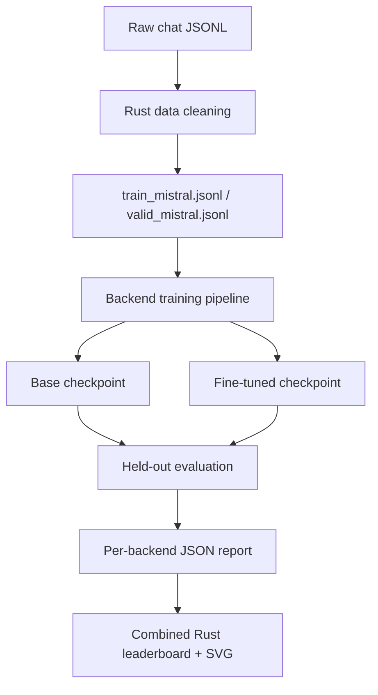

# Building a Local Fine-Tuning Benchmark Across Candle, Burn, PyTorch, and MLX

This repository now supports one concrete question:

How much does a small, real fine-tuning loop improve held-out behavior when we run the same benchmark shape across multiple training backends?

The answer is no longer theoretical. We have real pre-training checkpoints, real post-training checkpoints, held-out evaluation, comparable metrics, and one reporting surface across four backends:

- `candle`
- `burn`
- `pytorch`
- `mlx`

The important point is not that any one backend "wins" in the abstract. The important point is that the pipeline is now capable of answering the before-versus-after question with real artifacts, not proxy models and not synthetic scoring.

## Scope note

Author: **Hamze Ghalebi**

This work is associated with the "Hackathon: Benchmarking Small Language Models
in the Real World," organized by **AI Paris Thinker**, but it does not
implement the official `polarsbench.net` submission contract. It does not use
the hidden runner-provided dataset, the official platform evaluator, or the
official leaderboard score formula.

Accordingly, the results here should be interpreted as an independent local
benchmark for backend and fine-tuning comparison. They are not official
hackathon scores and should not be presented as directly comparable to the
platform leaderboard.

## Executive summary

On the current 20-row held-out evaluation slice:

| Backend | Train Wall Time | Fine-Tuned ROUGE-L | ROUGE-L Delta | Fine-Tuned Latency |
|---|---:|---:|---:|---:|
| `mlx` | `6.29s` | `0.1274` | `+0.1232` | `22.86 ms` |
| `pytorch` | `9.23s` | `0.1061` | `+0.1021` | `69.72 ms` |
| `burn` | `21.72s` | `0.0963` | `+0.0942` | `101.20 ms` |
| `candle` | `14.05s` | `0.0882` | `+0.0882` | `91.65 ms` |

On this benchmark:

- `MLX` produced the largest held-out ROUGE-L gain.
- `MLX` trained fastest.
- `MLX` also had the lowest fine-tuned inference latency.
- `PyTorch` outperformed both Rust-native backends on quality delta and latency.
- All four backends showed measurable post-training improvement on ROUGE-L.
- Exact match stayed at `0.0` across all runs, which is what we should expect from a small local causal language model on a limited held-out slice.

This is a useful result. It means the pipeline is sensitive enough to detect improvement, but still difficult enough that exact-match saturation is not hiding the differences between backends.

## What the system does

The repository is structured as a benchmark harness for supervised fine-tuning data and local training/evaluation loops.

At a high level:



The pipeline is deliberately split into two layers:

1. A shared data and evaluation contract.
2. Multiple backend-specific training implementations.

That separation matters because it lets us compare backends without changing the question we are asking.

## The contract that makes the comparison meaningful

Every backend is evaluated against the same held-out file:

- `data/valid_mistral.jsonl`

Every backend follows the same pre/post flow:

1. Initialize a base model.
2. Save a real base checkpoint.
3. Fine-tune that same model on the training split.
4. Save a real fine-tuned checkpoint.
5. Reload both checkpoints.
6. Evaluate both against the same held-out examples.
7. Emit a report with the same schema.

The shared report fields are:

- `backend`
- `train_summary`
- `base_checkpoint`
- `finetuned_checkpoint`
- `training_wall_ms`
- `eval_wall_ms`
- `base`
- `finetuned`
- `exact_match_delta`
- `rouge_l_delta`
- `response_len_delta`
- `latency_delta_ms`

The shared metrics are:

- exact match
- ROUGE-L
- response length
- latency

This is the core engineering decision in the project. We are not comparing frameworks by anecdotes. We are comparing them by having each framework produce the same evidence.

## Data flow

The data path remains Rust-first.

Input rows are cleaned into chat-style JSONL with `messages`, preserving the structure expected by conversational fine-tuning pipelines. The benchmark backends then consume the already-cleaned `train` and `valid` files rather than inventing their own task format.

That yields three benefits:

1. The benchmark is anchored to the real dataset shape.
2. The backend implementations stay simpler.
3. The evaluation prompt construction is identical across frameworks.

The held-out evaluation examples are formed by:

- taking all messages except the final assistant message as the prompt
- using the final assistant message as the target

So the system is always measuring the same task:

Given this conversation prefix, can the fine-tuned checkpoint generate a better assistant continuation than the base checkpoint?

## Backend implementations

### Candle

The Candle path is implemented in Rust and stores checkpoints as:

- `artifacts/candle-true-pre-post/base.safetensors`
- `artifacts/candle-true-pre-post/finetuned.safetensors`

Its role in the repository is important because it proves that a complete local pre/post benchmark can exist without Python.

### Burn

The Burn path is also implemented in Rust and stores checkpoints as:

- `artifacts/burn-true-pre-post/base.mpk`
- `artifacts/burn-true-pre-post/finetuned.mpk`

Burn required one adaptation: for this benchmark, decoder-only behavior is modeled through an encoder stack plus a causal attention mask. That keeps the task causal while fitting Burn's current transformer surface more cleanly.

### PyTorch

The PyTorch path is implemented in:

- [true_pre_post_pytorch.py](/Users/hamzeghalebi/projects/hakaton/mistral-fintune/scripts/true_pre_post_pytorch.py)

It uses:

- token embeddings
- positional embeddings
- pre-norm self-attention blocks
- causal masking
- AdamW
- MPS on Apple Silicon when available

It stores checkpoints as:

- `artifacts/pytorch-true-pre-post/base.pt`
- `artifacts/pytorch-true-pre-post/finetuned.pt`

### MLX

The MLX path is implemented in:

- [true_pre_post_mlx.py](/Users/hamzeghalebi/projects/hakaton/mistral-fintune/scripts/true_pre_post_mlx.py)

It uses:

- `mlx.nn.Embedding`
- `mlx.nn.MultiHeadAttention`
- additive causal masks
- `nn.value_and_grad`
- `optim.AdamW`
- Apple Silicon GPU execution

It stores checkpoints as:

- `artifacts/mlx-true-pre-post/base.npz`
- `artifacts/mlx-true-pre-post/finetuned.npz`

## Why the tokenizer is intentionally simple

All four backends use the same word-level tokenizer family for this benchmark.

That choice is not meant to mimic production tokenization. It is meant to isolate the training and evaluation loop from external model assets and backend-specific tokenizer dependencies.

In other words:

- the tokenizer is simple on purpose
- the benchmark is local on purpose
- the comparison is relative on purpose

That tradeoff makes the benchmark much easier to reproduce and much easier to reason about.

## Results

### Full held-out comparison

| Backend | Base ROUGE-L | Fine-Tuned ROUGE-L | ROUGE-L Delta | Base Latency | Fine-Tuned Latency | Train Wall Time |
|---|---:|---:|---:|---:|---:|---:|
| `mlx` | `0.0042` | `0.1274` | `+0.1232` | `52.94 ms` | `22.86 ms` | `6.29s` |
| `pytorch` | `0.0040` | `0.1061` | `+0.1021` | `189.31 ms` | `69.72 ms` | `9.23s` |
| `burn` | `0.0021` | `0.0963` | `+0.0942` | `130.40 ms` | `101.20 ms` | `21.72s` |
| `candle` | `0.0000` | `0.0882` | `+0.0882` | `170.60 ms` | `91.65 ms` | `14.05s` |

### Response-length effects

| Backend | Base Avg Response Len | Fine-Tuned Avg Response Len | Delta |
|---|---:|---:|---:|
| `mlx` | `48.0` | `32.9` | `-15.1` |
| `pytorch` | `48.0` | `48.0` | `0.0` |
| `burn` | `48.0` | `39.15` | `-8.85` |
| `candle` | `48.0` | `25.95` | `-22.05` |

### Training loss summary

| Backend | Final Loss | Min Loss |
|---|---:|---:|
| `mlx` | `1.8379` | `1.5301` |
| `pytorch` | `4.7964` | `4.5003` |
| `burn` | `5.4721` | `4.6112` |
| `candle` | `6.2383` | `5.6218` |

## How to read these results

Three patterns stand out.

### 1. Fine-tuning improved every backend

This is the most important result in the repository.

The pipeline is not just runnable. It is effective enough to show consistent held-out quality gains across four separate implementations. That means the benchmark design is doing useful work: it can distinguish "before" from "after."

### 2. The backend ranking is not just about training speed

If this were only a throughput contest, the fastest runtime would be enough. But here we are evaluating:

- quality delta
- training wall time
- inference latency
- response shape

That gives us a more realistic engineering picture. A backend can be fast and still underperform on quality. A backend can improve quality and still be too slow for the intended workload. The system now exposes those tradeoffs directly.

### 3. MLX is the strongest current fit for this machine and this benchmark

On Apple Silicon, MLX is a natural candidate. The benchmark results support that expectation rather than merely repeating it:

- best ROUGE-L delta
- fastest train time
- lowest fine-tuned latency

That does not mean MLX is universally best. It means that, for this exact local benchmark on this exact hardware, MLX is currently the strongest backend in the repository.

## Why exact match stayed at zero

This is not a failure. It is a signal about the regime we are operating in.

The benchmark uses:

- a small model
- a small held-out set
- open-ended assistant continuations

Exact match is often too brittle for this setting. Two responses can be semantically closer and still fail exact-match scoring. That is why ROUGE-L is the more informative metric here.

The right interpretation is:

- exact match tells us the task is still hard
- ROUGE-L tells us fine-tuning is moving outputs in the right direction

## Reproducibility

The consolidated comparison is generated from:

- [all_backend_comparison_report.json](/Users/hamzeghalebi/projects/hakaton/mistral-fintune/artifacts/all-backend-comparison/all_backend_comparison_report.json)
- [all_backend_comparison_leaderboard.md](/Users/hamzeghalebi/projects/hakaton/mistral-fintune/artifacts/all-backend-comparison/all_backend_comparison_leaderboard.md)
- [all_backend_comparison.svg](/Users/hamzeghalebi/projects/hakaton/mistral-fintune/artifacts/all-backend-comparison/all_backend_comparison.svg)

The full run commands are:

```bash
cargo run --features candle --bin 07_candle_true_pre_post -- \
  --train-path data/train_mistral.jsonl \
  --valid-path data/valid_mistral.jsonl \
  --run-dir artifacts/candle-true-pre-post \
  --train-limit 512 \
  --eval-limit 20 \
  --steps 800 \
  --max-seq-len 128 \
  --d-model 128 \
  --n-layers 3 \
  --mlp-hidden 512 \
  --max-new-tokens 48

cargo run --features burn --bin 08_burn_true_pre_post -- \
  --train-path data/train_mistral.jsonl \
  --valid-path data/valid_mistral.jsonl \
  --run-dir artifacts/burn-true-pre-post \
  --train-limit 512 \
  --eval-limit 20 \
  --steps 800 \
  --max-seq-len 128 \
  --d-model 128 \
  --n-heads 4 \
  --n-layers 3 \
  --mlp-hidden 512 \
  --max-new-tokens 48

.venv-ml/bin/python scripts/true_pre_post_pytorch.py \
  --train-path data/train_mistral.jsonl \
  --valid-path data/valid_mistral.jsonl \
  --run-dir artifacts/pytorch-true-pre-post \
  --train-limit 512 \
  --eval-limit 20 \
  --steps 800 \
  --max-seq-len 128 \
  --d-model 128 \
  --n-heads 4 \
  --n-layers 3 \
  --mlp-hidden 512 \
  --max-new-tokens 48

.venv-ml/bin/python scripts/true_pre_post_mlx.py \
  --train-path data/train_mistral.jsonl \
  --valid-path data/valid_mistral.jsonl \
  --run-dir artifacts/mlx-true-pre-post \
  --train-limit 512 \
  --eval-limit 20 \
  --steps 800 \
  --max-seq-len 128 \
  --d-model 128 \
  --n-heads 4 \
  --n-layers 3 \
  --mlp-hidden 512 \
  --max-new-tokens 48

cargo run --features "candle burn" --bin 10_compare_all_backends -- \
  --report artifacts/candle-true-pre-post/true_pre_post_report.json \
  --report artifacts/burn-true-pre-post/true_pre_post_report.json \
  --report artifacts/pytorch-true-pre-post/true_pre_post_report.json \
  --report artifacts/mlx-true-pre-post/true_pre_post_report.json \
  --out-dir artifacts/all-backend-comparison
```

## Limits of the current benchmark

There are real limits here.

### The model is intentionally small

This benchmark is designed for local iteration and backend comparison. It is not meant to approximate the absolute behavior of a large production model.

### The tokenizer is simplified

That makes the benchmark reproducible across frameworks, but it also means the quality ceiling is lower than a production tokenizer-and-checkpoint stack.

### The held-out slice is small

Twenty examples are enough to show directional differences. They are not enough to support strong claims about generalization at larger scale.

So the current system answers:

> Does this backend improve measurable behavior after fine-tuning, and by how much, on this local benchmark?

It does not yet answer:

> Which backend is globally optimal for production workloads?

## Where this should go next

There are three obvious next steps.

1. Increase the held-out evaluation size so the ranking is less sensitive to small-sample noise.
2. Add multiple fine-tuning strategies per backend so we can compare technique as well as framework.
3. Keep the report schema stable and extend it rather than replacing it. That is what preserves comparability over time.

## Bottom line

The repository now has a real comparative fine-tuning benchmark.

That benchmark shows:

- training changes the model in measurable ways
- the measurement is consistent across four backends
- MLX is currently the strongest backend on this Apple Silicon setup
- PyTorch is a strong second option
- Candle and Burn remain valuable as Rust-native baseline and experimentation paths

That is the real outcome of the work: not just more code, but a system that can answer a concrete engineering question with evidence.
