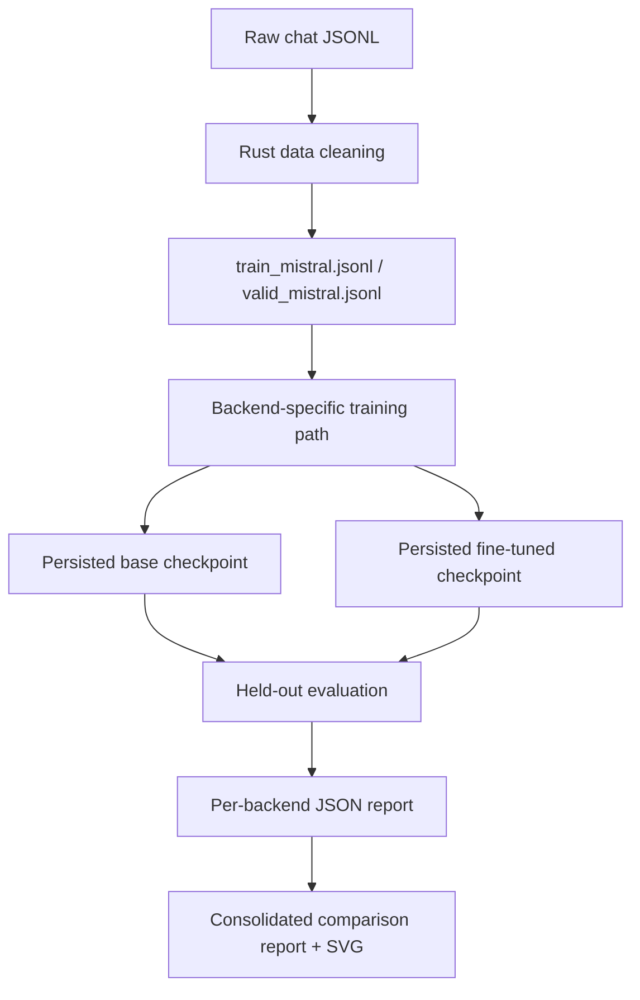

# Architecture and benchmark note

Author: **Hamze Ghalebi**

This document summarizes the benchmark design implemented in this repository.
It follows the updated paper text and should be treated as the prose companion
to the executable benchmark artifacts.

## Scope

This repository was developed in the context of the "Hackathon: Benchmarking
Small Language Models in the Real World," organized by **AI Paris Thinker**.
The benchmark reported here is not an official hackathon evaluation. It does
not use the official `polarsbench.net` platform, the hidden evaluation dataset,
or the official leaderboard scoring path.

The results should therefore be interpreted as an independent local benchmark.

## Benchmark goal

The benchmark addresses one narrow engineering question:

> Under a fixed dataset split, a fixed held-out evaluation slice, and a fixed
> small-model training recipe, how do Candle, Burn, PyTorch, and MLX differ in
> post-fine-tuning quality, training wall time, and inference latency?

The goal is operational rather than theoretical. The benchmark does not try to
establish a universal ranking of frameworks. It measures how four concrete
implementations behave under one fixed local setup.

## High-level design

The benchmark has two layers:

1. a shared data-and-evaluation contract
2. backend-specific training implementations

This separation is intentional. It keeps the task definition fixed while
allowing execution details to vary by backend.

## Data contract

The cleaned dataset preserves a conversational `messages` array.

For each evaluation example:

- all messages except the final assistant message become the prompt
- the final assistant message becomes the reference target

Every backend therefore solves the same continuation task.

## Backend implementations

### Candle

- Rust implementation
- checkpoint format: `safetensors`
- role: Rust-native reference backend

### Burn

- Rust implementation
- checkpoint format: `mpk`
- uses an encoder-style stack with a causal attention mask for this benchmark

### PyTorch

- Python 3.12 implementation via `uv`
- uses token embeddings, positional embeddings, pre-norm self-attention,
  causal masking, and AdamW
- uses MPS acceleration on Apple Silicon when available

### MLX

- Python 3.12 implementation via `uv`
- uses `mlx.nn.Embedding`, `mlx.nn.MultiHeadAttention`, additive causal masks,
  `nn.value_and_grad`, and AdamW

## Experimental configuration

The reported benchmark fixes the following settings across all four backends:

- training split: `data/train_mistral.jsonl`
- validation split: `data/valid_mistral.jsonl`
- training rows: `512`
- held-out evaluation rows: `20`
- training steps: `800`
- maximum sequence length: `128`
- model dimension: `128`
- attention heads: `4`
- layers: `3`
- hidden dimension: `512`
- maximum generated tokens: `48`

All four backends use a deliberately simple word-level tokenizer. This improves
self-containment and comparability, but it is not representative of production
subword tokenization.

## Evaluation protocol

Every backend follows the same evaluation sequence:

1. initialize a base model
2. save a persisted base checkpoint
3. fine-tune that model on the training split
4. save a persisted fine-tuned checkpoint
5. reload both checkpoints
6. evaluate both checkpoints on the same held-out examples
7. emit a report in the same JSON schema

Shared metrics:

- exact match
- ROUGE-L
- response length
- latency

ROUGE-L is the principal automatic quality metric in this repository because the
benchmark task is open-ended assistant continuation rather than strict string
reproduction.

## Current reported result

| Backend | Base ROUGE-L | Fine-Tuned ROUGE-L | ROUGE-L Delta | Fine-Tuned Latency | Train Wall Time |
|---|---:|---:|---:|---:|---:|
| `mlx` | `0.0042` | `0.1274` | `+0.1232` | `22.86 ms` | `6.29s` |
| `pytorch` | `0.0040` | `0.1061` | `+0.1021` | `69.72 ms` | `9.23s` |
| `burn` | `0.0021` | `0.0963` | `+0.0942` | `101.20 ms` | `21.72s` |
| `candle` | `0.0000` | `0.0882` | `+0.0882` | `91.65 ms` | `14.05s` |

Interpretation:

- all four backends improve ROUGE-L after fine-tuning
- MLX records the largest ROUGE-L increase in the current reported run set
- MLX also has the shortest training wall time and the lowest fine-tuned
  latency on this Apple Silicon setup
- exact match remains `0.0` for all four backends on the current 20-example
  held-out slice

## Limitations

The benchmark should be interpreted narrowly.

- it uses an intentionally small model
- it uses a simplified tokenizer
- the held-out slice is small
- the reported values come from single runs, not repeated trials
- the implementations are behaviorally aligned, not numerically identical
- ROUGE-L measures lexical overlap, not full semantic adequacy

These results are descriptive, not inferential.

## Canonical artifacts

- consolidated report:
  [all_backend_comparison_report.json](/Users/hamzeghalebi/projects/hakaton/mistral-fintune/artifacts/all-backend-comparison/all_backend_comparison_report.json)
- consolidated leaderboard:
  [all_backend_comparison_leaderboard.md](/Users/hamzeghalebi/projects/hakaton/mistral-fintune/artifacts/all-backend-comparison/all_backend_comparison_leaderboard.md)
- consolidated SVG visualization:
  [all_backend_comparison.svg](/Users/hamzeghalebi/projects/hakaton/mistral-fintune/artifacts/all-backend-comparison/all_backend_comparison.svg)
- paper source:
  [local_finetuning_benchmark_paper.tex](/Users/hamzeghalebi/projects/hakaton/mistral-fintune/output/pdf/local_finetuning_benchmark_paper.tex)
- paper PDF:
  [local_finetuning_benchmark_paper.pdf](/Users/hamzeghalebi/projects/hakaton/mistral-fintune/output/pdf/local_finetuning_benchmark_paper.pdf)
