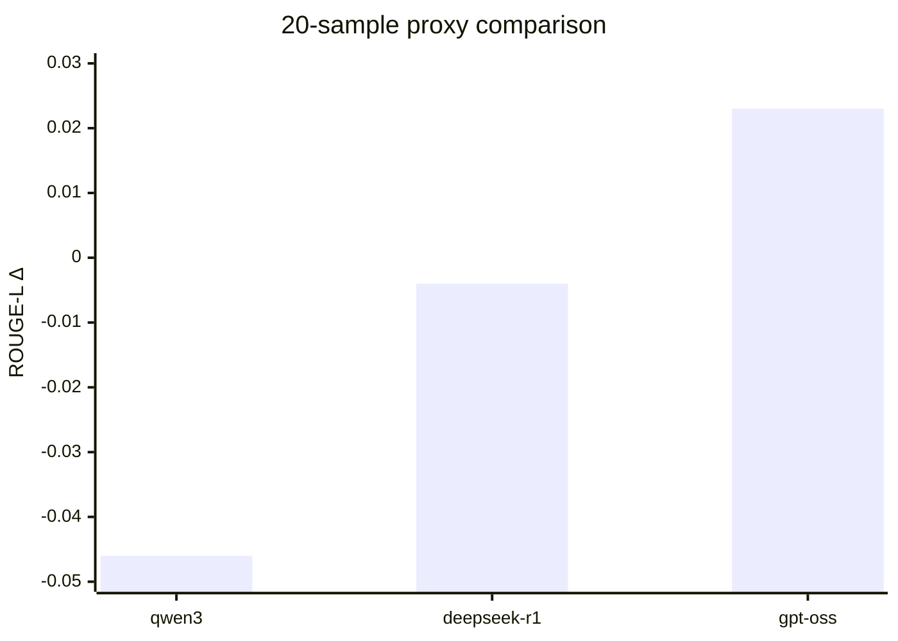
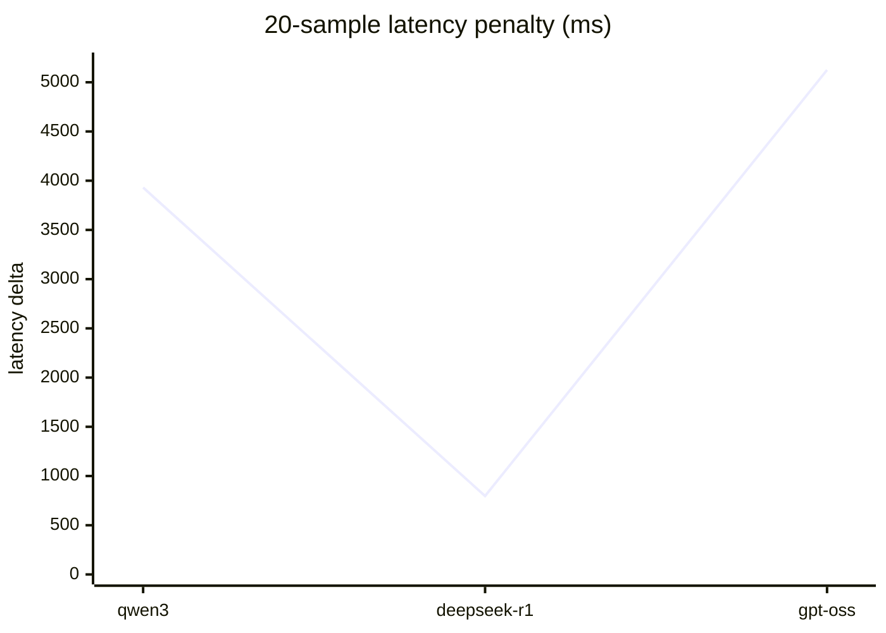

# Rust Fine-Tune Candidate Leaderboard (Rust + Ollama Inference)

## 20-Sample Run (proxy model candidates)

| Model Variant | Exact Match Δ | ROUGE-L Δ | Base Latency (ms) | Candidate Latency (ms) | Latency Δ (ms) | Base Resp Len | Candidate Resp Len |
|---|---:|---:|---:|---:|---:|---:|---:|
| qwen3:latest | 0.000 | -0.046 | 7242.9 | 11173.4 | 3930.5 | 71.55 | 85.70 |
| deepseek-r1:8b | 0.000 | -0.004 | 4300.2 | 5097.1 | 796.9 | 72.20 | 83.30 |
| gpt-oss:120b | 0.000 | 0.023 | 3865.2 | 8990.2 | 5125.0 | 71.55 | 45.10 |

## 10-Sample Technical Sweep (candidate + decode settings)

See full matrix: `artifacts/rust_tech_sweep_limit10.md`

### Top values from sweep

- ROUGE-L best: `deepseek-r1:8b (temp0.0_toks64)` with Δ = **0.006**.
- Lowest latency overhead: `deepseek-r1:8b (temp0.0_toks64)` with Δ = **421.9 ms**.
- Exact match: **0.000** for all configurations.

## Notes

- There is still **no true fine-tuned model artifact** in this repo yet.
- Results above are proxy comparisons of post-training-style candidates using the same held-out evaluator.

## Visualization

